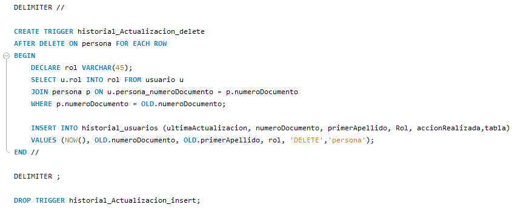

# Base de Datos Empleados
Base de datos para ayudar a tener el registro de los empleados de una empresa, manejando dos roles con el fin de que las opciones de empleador como empleado sea variado. MySQL Workbench.

Esta aplicación cuenta con dos módulos principales, y estan diseñados segun el digrama de caso de usos, en donde se especifica la necesidad de dos tipos de usuarios.
<h2>Módulos</h2>

<table align="center">
  
<tr>
<td width="50%">
<h2 align="center">Diagrama de Casos de Uso</h2>

  

                                                                                   
</td>  
  
 <td width="50%">
	<h2 align="center">Módulo</h2>
 

    <ol>
  <li>
    <h3>Usuarios</h3>
    <ul>
      <li>Registro hoja de vida (datos usuario, experiencia, estudios).</li>
      <li>Creación de ususario.</li>
      <li>Actualización de datos personales.</li>
      <li>Generación de constancia de trabajo.</li>
    </ul>
  </li>

  <li>
    <h3>Administrador</h3>
    <ul>
      <li>Actualizar estado del trabajador (activo, retirado, vacaciones).</li>
      <li>Aumentar sueldo de trabajador.</li>
      <li>Cantidad de trabajadores por sede.</li>
      <li>Ver lista de antigüedad.</li>
      <li>Cargo y sueldo.</li>
      <li>Estrato.</li>
    </ul>
    
  </li>
</ol>
 

                                                                                      
</td> 
  

</tr>
</table>

La creación de esta [base de datos](/proyecto_bd_ud.sql) siguió un proceso meticuloso. Inicialmente, se diseñó un modelo de entidad-relación, teniendo en cuenta las reglas de normalización para garantizar la integridad y eficiencia de la base de datos. Posteriormente, este modelo fue refinado y se procedió a su implementación mediante SQL, creando las tablas y estableciendo las relaciones necesarias para el correcto funcionamiento del sistema.

Después de completar la construcción de la base de datos, se procedió a la creación de los usuarios, asignándoles los permisos adecuados. Posteriormente, se desarrollaron procedimientos almacenados con el objetivo de agilizar y asegurar las [consultas a la base de datos](/proyecto_ud_consultas.sql), al mismo tiempo que se implementaron como medida de seguridad para prevenir la inyección masiva de datos. Además, se establecieron una serie de triggers para realizar un seguimiento detallado de los movimientos efectuados por los usuarios en la base de datos.

| **Modelo Entidad Relación** | **Procedimiento** | **Trigger** |
|:----------------------:|:-----------------:|:---------------:|
|  |  | |

